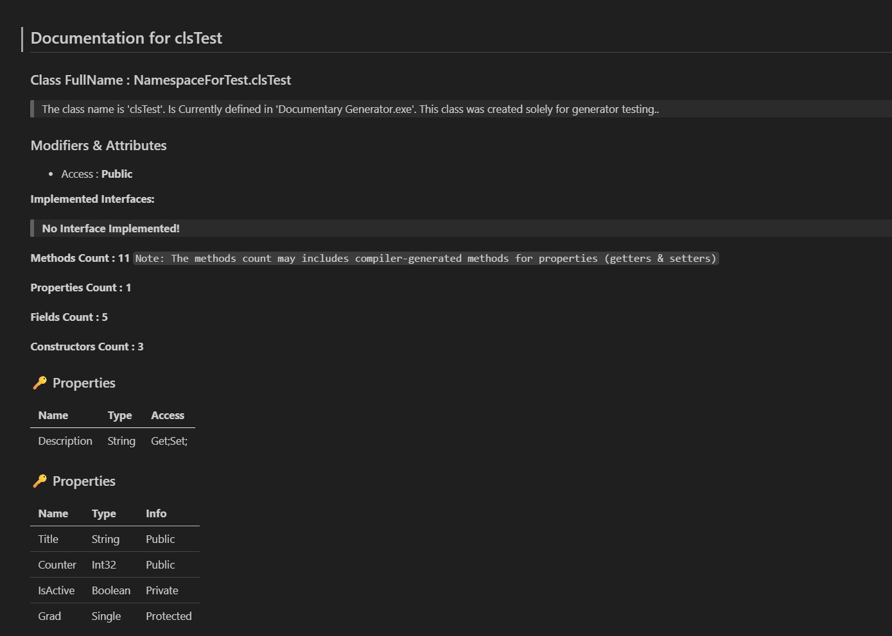
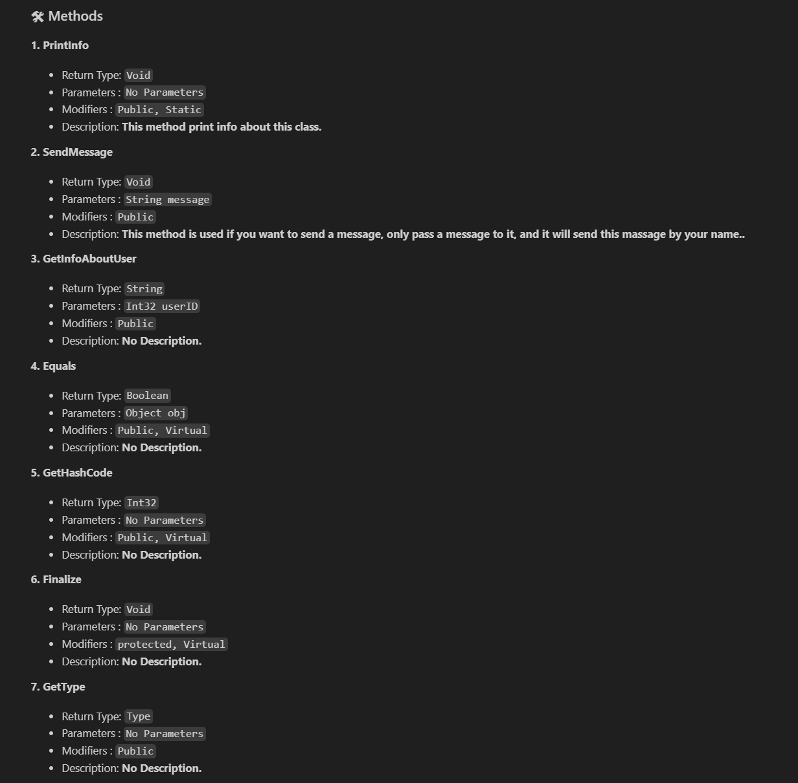
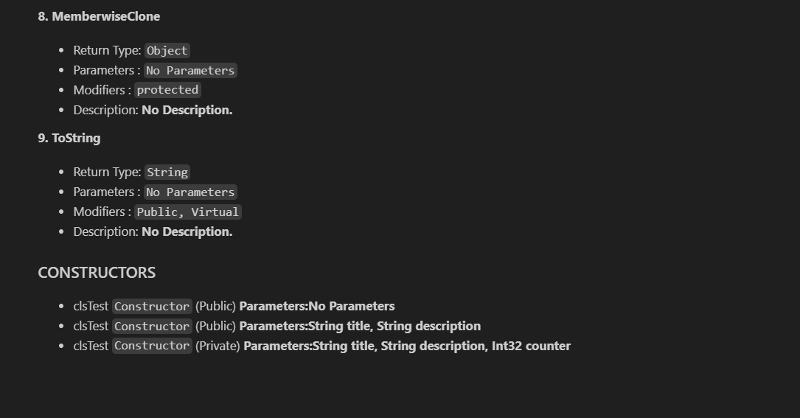

ReflectoDoc: An Automated Reflection-Based Documentation Generator for .NET.

A C# tool designed to bridge the gap between code and documentation. By leveraging System.Reflection, it scans your assemblies and source code to generate structured, professional Markdown files. Whether you are documenting a single class or an entire external DLL, ReflectoDoc provides a clear technical overview of your software architecture.

## ✨ Key Features:

Deep Reflection: Extract Methods, Properties, Fields, and Constructors with their access modifiers and parameters.

External Assembly Support: Seamlessly document third-party libraries and external .dll files.

Clean Output: Intelligently filters out compiler-generated members and backing fields for a human-readable experience.

GitHub Ready: Outputs perfectly formatted Markdown with tables, lists, and emojis, optimized for GitHub previews.

## 🛠 Usage Guide

ReflectoDoc is a versatile tool that allows you to generate documentation in three different ways depending on your needs: documenting a single class, an entire project, or an external library.

1. Adding Custom Descriptions (Optional)
   To include custom explanations in the generated documentation, apply the `DecriptionAttribute` to your classes or methods:

   ```
   [DecriptionAttribute("This class manages mathematical operations.")]
   public class MyClass {
   [DecriptionAttribute("This method calculates the sum of two integers.")]
   public int Sum(int a, int b) => a + b;
   }
   ```

2. Documenting a Single Class
   To generate a Markdown file for a specific class:

   ```
   // Initialize the generator with the target class type
   DocumentaryGenerator dg = new DocumentaryGenerator(typeof(MyClass));

   // This will automatically create "MyClass.md" in your project folder
   dg.CreateClassDocumenrty();
   ```

3. Documenting an Entire Project (Current Assembly)
   To document all public classes within your current running project into a single comprehensive file:

   ```
   // This generates a file named "AssemblyDocumentary.md" by default
   DocumentaryGenerator.CreateAssemblyDocumenrty(Assembly.GetExecutingAssembly());
   ```

4. Documenting an External Library (External DLL)
   This is a powerful feature for inspecting and documenting third-party libraries where you don't have the source code:

   ```
   string dllPath = @"C:\Path\To\Your\Library.dll";

   // Analyze the external file and generate a custom-named documentation file
   DocumentaryGenerator.CreateExternalAssemblyDocumenrty(dllPath, "External_Library_Doc.md");
   ```

## 📖 What’s Inside the Generated Documentation?

The generated Markdown file includes several key sections to provide a clear technical overview:

Smart Statistics: Counts for methods, properties, and fields.

- **Inheritance Analysis**: Clearly shows the base class and any implemented interfaces.
- **Organized Tables**: Displays properties and fields with their data types and access levels.
- **Method Details**: Comprehensive lists of return types, parameters, and modifiers (e.g., Static, Virtual).
- **Description Support**: Automatically pulls and displays text written within your DecriptionAttribute.

# 🖼 Preview






